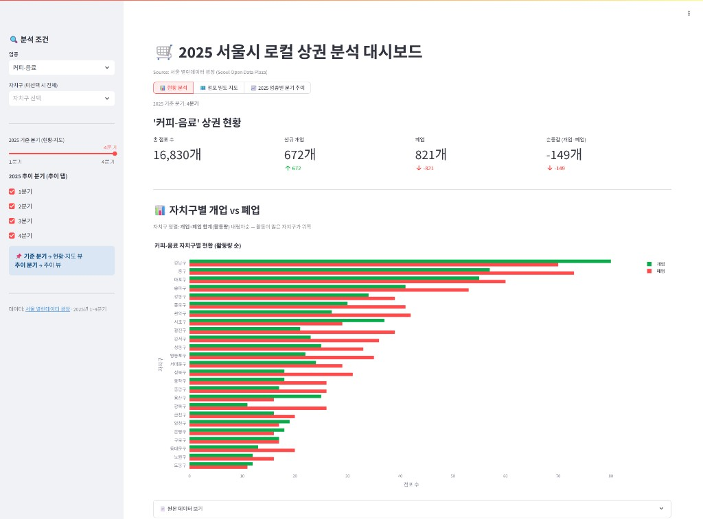
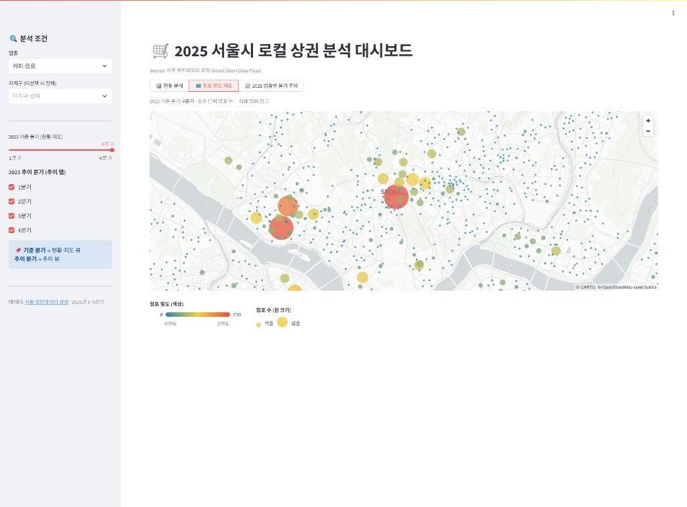
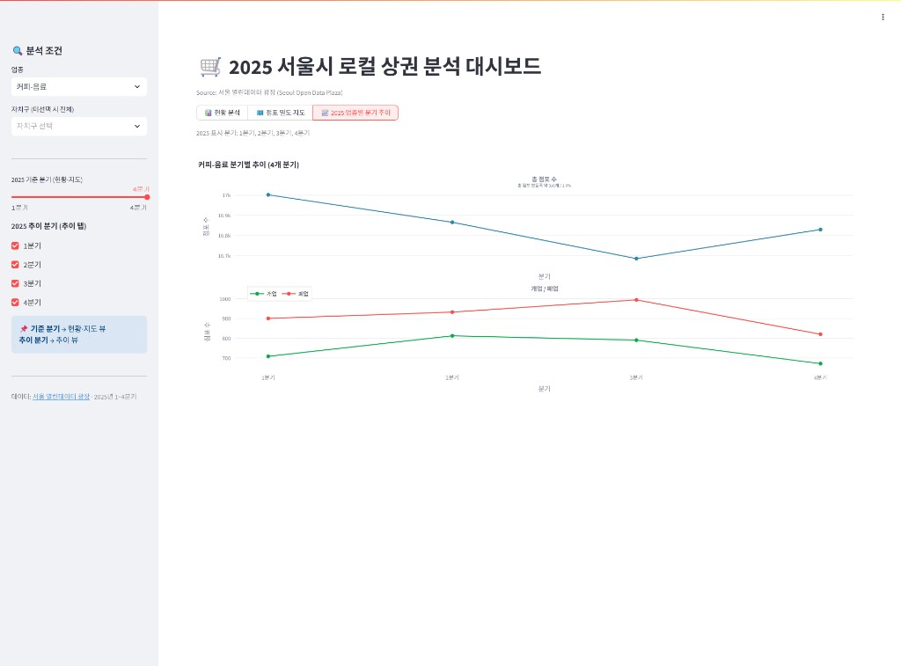
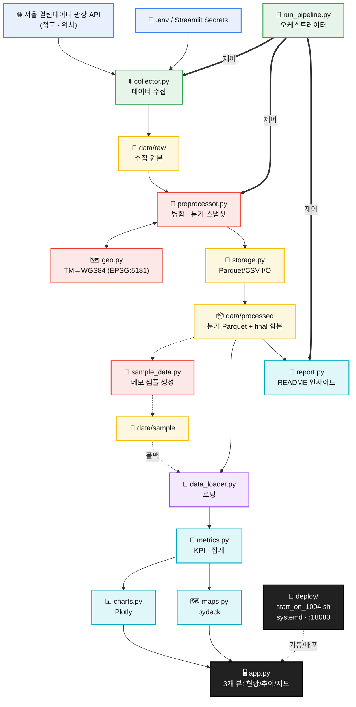

# 🛒 서울시 상권 데이터 분석 대시보드

[](https://github.com/JamesRhee1/seoul-local-market-remake/actions/workflows/ci.yml)


서울시 열린데이터 광장의 상권 데이터를 **수집 → 전처리 → 분석 → 시각화**하는 Streamlit 대시보드 프로젝트입니다.

**작동 중인 데모**는 [http://bigsoft.iptime.org:18080/](http://bigsoft.iptime.org:18080/) 에서 바로 확인할 수 있습니다.

## 목차

- [프로젝트 개요](#프로젝트-개요)
- [대시보드 미리보기](#대시보드-미리보기)
- [주요 기능](#주요-기능)
- [설치 및 실행](#설치-및-실행-방법)
- [데이터 파이프라인](#데이터-파이프라인--시스템-아키텍처)
- [프로젝트 구조](#프로젝트-구조)
- [주요 데이터 컬럼](#주요-데이터-컬럼)
- [테스트](#테스트-실행)
- [향후 개선 과제](#향후-개선-과제)
- [리메이크 방향](#리메이크-방향)
- [라이선스](#라이선스)

---

## 프로젝트 개요

이 프로젝트는 [서울 열린데이터 광장](https://data.seoul.go.kr/)의 상권 데이터를 기반으로
서울시 상권 현황을 수집·전처리·분석하고, Streamlit 대시보드로 시각화합니다.

자치구·업종·분기 단위로 점포 수와 개업/폐업 흐름을 살펴볼 수 있으며,
데이터 수집부터 대시보드까지의 과정을 `src/` 패키지로 모듈화해
각 단계를 독립적으로 실행하고 테스트할 수 있도록 구성했습니다.

API 키나 대용량 데이터가 없어도, 저장소에 포함된 소형 샘플 데이터로 대시보드를 바로 실행할 수 있습니다.

이 README는 **설치·실행·사용법**을 다룹니다. 리메이크 배경, 기존 프로젝트 대비 개선점, 파이프라인·모듈 설계 회고는 **[프로젝트 노트](docs/project_notes.md)**에서 확인할 수 있습니다.

---

## 대시보드 미리보기

작동 중인 대시보드는 **[http://bigsoft.iptime.org:18080/](http://bigsoft.iptime.org:18080/)** 에서 확인할 수 있습니다. 아래는 동일 UI(`st.segmented_control` 3개 뷰)의 스크린샷입니다.

사이드바에서 **업종·자치구·기준 분기(현황·지도)** / **추이 분기(추이 뷰)** 를 바꾸면 KPI(순증감 포함)·활동량 순 막대그래프·점포 밀도 지도·4개 분기 추이를 탐색할 수 있습니다. 예시는 **커피-음료 · 2025년 4분기** 기준입니다.



<details>
<summary>점포 밀도 지도 보기</summary>



</details>

<details>
<summary>업종별 분기 추이 보기</summary>



</details>

---

## 주요 기능

- 서울시 상권(점포·위치) 데이터 수집 (서울 열린데이터 광장 API)
- `data/processed` 가공 데이터 우선 로딩
- 가공 데이터가 없으면 `data/sample` 샘플 데이터로 자동 폴백
- Streamlit 기반 인터랙티브 대시보드 제공
- 총 점포 수 / 개업 / 폐업 KPI 카드 표시
- 업종 및 자치구 기준 필터링
- 자치구별 개업 vs 폐업 Plotly 막대그래프 시각화
- **3개 뷰** — 현황 분석 / 점포 밀도 지도 / 업종별 분기 추이 (`st.segmented_control`)
- **업종별 분기 추이** 2단 패널 차트 (2025년 1분기~4분기, 최신 `2025-4분기` 라벨)
- **상권 단위 점포 밀도** pydeck 지도 (크기·색상 ∝ 밀도)
- 원본 데이터 테이블 조회
- KPI·집계 등 지표 계산 로직 모듈화 (순수 함수)
- `pytest` 기반 단위 테스트 지원

---

## 설치 및 실행 방법

### Linux / macOS

```bash
git clone https://github.com/JamesRhee1/seoul-local-market-remake.git
cd seoul-local-market-remake

python3 -m venv .venv
source .venv/bin/activate

pip install -r requirements.txt
streamlit run app.py
```

### Windows PowerShell

```powershell
git clone https://github.com/JamesRhee1/seoul-local-market-remake.git
cd seoul-local-market-remake

python -m venv .venv
.venv\Scripts\Activate.ps1

pip install -r requirements.txt
streamlit run app.py
```

가공 데이터가 없으면 대시보드는 자동으로 `data/sample/` 의 샘플 데이터로 실행됩니다.

### 데이터 파이프라인 한 번에 실행

수집 → 전처리 → README 인사이트 갱신을 한 번에 실행하려면:

```bash
python run_pipeline.py
```

- `SEOUL_API_KEY` 가 설정되어 있으면 수집부터, 없으면 수집을 건너뛰고 기존 데이터로 진행합니다.
- 각 단계는 `python -m src.collector`, `python -m src.preprocessor`, `python -m src.report` 로 개별 실행할 수도 있습니다.
- 분석 기준 분기는 **2025년 1분기~4분기** (분기 코드 `20251`, `20252`, `20253`, `20254` / 최신 **2025-4분기**)입니다.
- `.env` 의 `TARGET_QUARTER` 에 **쉼표로 여러 분기**를 지정하면 `run_pipeline.py` 한 번으로 순차 수집·전처리합니다 (예: `20251,20252,20253,20254`).
- `TARGET_QUARTER` 를 **비우면** API 전체 연도·분기를 수집하므로, 2025년만 필요할 때는 위 예시처럼 명시하는 것을 권장합니다. 비어 있고 API 키가 있으면 `run_pipeline.py` 는 **20251~20254** 를 기본 사용합니다.

```bash
# .env 예시 — 2025년 1~4분기
TARGET_QUARTER=20251,20252,20253,20254
COLLECT_LIMIT=0
```

---

## 자체 서버 배포 (Linux)

집/실험실 PC 등에서 Streamlit 을 직접 띄우고 공유기 포트포워딩으로 외부 공개할 때 사용합니다. **현재 배포 URL**: [http://bigsoft.iptime.org:18080/](http://bigsoft.iptime.org:18080/)

```bash
git clone https://github.com/JamesRhee1/seoul-local-market-remake.git
cd seoul-local-market-remake
python3 -m venv .venv && source .venv/bin/activate
pip install -r requirements.txt
cp .env.example .env   # SEOUL_API_KEY 등 입력

# 데이터 (선택): python run_pipeline.py
bash deploy/start_on_1004.sh   # 0.0.0.0:18080 기동
```

- `deploy/start_on_1004.sh` — venv 활성화, `.streamlit/config.toml`(port **18080**) 생성, Streamlit 백그라운드 기동
- 공유기 **포트포워딩**: 외부 `18080` → 서버 LAN IP `18080` (TCP)
- systemd 등록: `deploy/seoul-market-streamlit.service` 참고
- **데이터 수집·전처리**는 대시보드와 분리해 실행하는 것을 권장합니다. 파이프라인 실행 중 `data/processed/` 가 갱신되면 대시보드 캐시가 무효화될 수 있습니다.

### 대시보드 성능 (2026-06 갱신)

실데이터(30만 행+) 환경에서 **화면 깜빡임·`Running...` 반복**을 줄이기 위해 `app.py` 에 다음을 적용했습니다.

| 항목 | 내용 |
|---|---|
| 뷰 전환 | `st.tabs` → **`st.segmented_control`** — 선택한 뷰만 렌더 (지도/추이 미선택 시 pydeck·추이 I/O 생략) |
| 캐시 | `get_trend_data`, Plotly 차트, pydeck `Deck` — `@st.cache_data` / `@st.cache_resource` |
| rerun 격리 | 지도·추이 — `@st.fragment` |
| pydeck | `pickable=False` — hover/click 에 의한 rerun 루프 완화 (호버 툴팁 비활성) |
| 위젯 | 사이드바·뷰 전환에 `key=` 고정 |

---

### 데모용 샘플 데이터 생성

processed 데이터가 있을 때, 분기별 소형 샘플을 `data/sample/` 에 만듭니다:

```bash
python -m src.sample_data
```

생성 결과 (2025년 1~4분기, 분기별 250행 샘플 + 합본):

```
data/sample/seoul_market_20251.parquet
data/sample/seoul_market_20252.parquet
data/sample/seoul_market_20253.parquet
data/sample/seoul_market_20254.parquet
data/sample/seoul_market_final.parquet
```

API 키 없이도 **분기 추이·지도** 화면까지 데모할 수 있습니다 (`processed` 없을 때 `sample` 폴백).

---

## Streamlit Community Cloud 배포

이 저장소는 [Streamlit Community Cloud](https://streamlit.io/cloud) 배포를 전제로 구성되어 있습니다.
**대시보드 데모만** 올릴 경우 API 키 없이 `data/sample/` 폴백으로 동작합니다.

### 배포 절차

1. GitHub 저장소를 Streamlit Cloud 에 연결합니다.
2. **Main file path** 를 `app.py` 로 지정합니다.
3. **Python version** 을 `3.11` 이상으로 맞춥니다 (`requirements.txt` 기준).
4. (선택) 앱 **Settings → Secrets** 에 아래 형식으로 시크릿을 등록합니다.

### Secrets 예시 (`secrets.toml`)

Streamlit Cloud 콘솔의 Secrets 편집기에 TOML 형식으로 입력합니다.
**`.env` 파일은 Git에 올리지 마세요.** 로컬 개발용으로만 사용합니다.

```toml
# 서울 열린데이터 광장 인증키 (Cloud 에서 수집 파이프라인을 돌릴 때만 필요)
SEOUL_API_KEY = "your_key_here"

# (선택) 수집 상한
COLLECT_LIMIT = "20000"

# (선택) 수집할 분기 — 쉼표로 여러 개 (2025년 1~4분기 예시)
TARGET_QUARTER = "20251,20252,20253,20254"
```

| 항목 | 로컬 | Streamlit Cloud |
|---|---|---|
| API 키 | `.env` 의 `SEOUL_API_KEY` | Secrets 의 `SEOUL_API_KEY` |
| 데모 실행 | `data/sample/` 폴백 | 동일 (저장소에 포함) |
| 가공 데이터 | `data/processed/` (Git 제외) | Cloud 빌드에 없음 → 샘플 폴백 |
| 분기 추이·지도 | processed 재생성 후 사용 | `data/sample/` 2025년 1~4분기 샘플로 데모 가능 |

> **권장:** Community Cloud 앱은 **대시보드 전시용**으로 두고, 데이터 수집·전처리(`run_pipeline.py`)는 로컬 또는 CI/스케줄러에서 실행한 뒤 `data/processed` 를 별도 스토리지로 관리하는 방식이 안전합니다. processed 를 Cloud 에 포함시키려면 Git LFS·외부 스토리지 연동 등 추가 설계가 필요합니다.

### 배포 전 점검 체크리스트

- [ ] `requirements.txt` 에 `streamlit`, `pyarrow`, `pydeck`, `pyproj` 포함
- [ ] `app.py` 가 저장소 루트에 있음
- [ ] `.env` / 실제 API 키가 Git에 커밋되지 않음 (`.gitignore` 확인)
- [ ] `pytest` / `ruff check` 로컬 통과 (CI 워크플로 동일)

---

## 대시보드 활용 예시

대시보드를 통해 다음과 같은 질문을 탐색할 수 있습니다.

- 특정 자치구의 상권 규모(점포 수)는 어느 정도인가?
- 업종별 점포 수는 어떻게 다른가?
- 자치구별 개업/폐업 흐름은 어떻게 다른가?
- 특정 업종을 선택했을 때 자치구별 경쟁 강도는 어떻게 나타나는가?
- 2025년 1~4분기 동안 특정 업종의 개업·폐업 추이는 어떻게 변했는가?
- 상권 단위로 점포가 어디에 밀집해 있는가?

사이드바에서 업종과 자치구를 선택하면 KPI·막대 차트·분기 추이·지도가 함께 갱신됩니다.

---

## 데이터 기반 인사이트 (자동 생성)

`src/report.py` 가 가공 데이터에서 핵심 지표를 계산해 아래 구간을 자동으로 갱신합니다.
전처리(`python -m src.preprocessor`) 직후, 또는 `python -m src.report` 실행 시 최신 내용으로 바뀝니다.

<!-- AUTO-INSIGHTS:START -->

> 📂 아래 수치는 **실제 수집 데이터에서 자동 생성**되었습니다 — **최신 분기 `2025-4분기` 기준**, 점포 **75,985행** · 100개 업종 · 25개 자치구 · 1650개 상권. _(생성: 2026-06-18 14:15, `python -m src.report`)_

### 1. 성장하는 업종 vs 쇠퇴하는 업종 — "지금 뜨는 시장 / 지는 시장"

분기 내 **순증감(개업 − 폐업)** 으로 시장의 진입·철수 방향을 읽을 수 있습니다.

| 순증가 상위 (성장) | 개업 | 폐업 | 순증 | | 순감소 상위 (쇠퇴) | 개업 | 폐업 | 순증 |
|---|--:|--:|--:|---|---|--:|--:|--:|
| 피부관리실 | 407 | 212 | **+195** | | 일반의류 | 417 | 1,032 | **−615** |
| 슈퍼마켓 | 392 | 215 | **+177** | | 부동산중개업 | 13 | 448 | **−435** |
| DVD방 | 122 | 6 | **+116** | | 전자상거래업 | 20 | 308 | **−288** |

→ **인사이트:** 이번 분기 순증 1위는 **피부관리실**(+195), 순감소 1위는 **일반의류**(−615). 신규 창업·투자라면 순증 업종에, 리스크 관리라면 순감소 업종에 주목하게 됩니다.

> 참고: `순증` 수치는 서울 열린데이터 광장 원천 데이터의 업종 분류 기준을 그대로 집계한 결과입니다. 업종 코드 재분류나 원천 입력 방식의 영향이 있을 수 있어, 해석 시 이상치 가능성을 함께 고려하세요.

### 2. 창업 리스크 — "여긴 들어가면 위험한 시장인가"

점포 수 대비 폐업 비중(**폐업률**)으로 업종의 생존 난이도를 가늠합니다. (점포 500개 이상 업종 대상)

| 업종 | 점포 수 | 폐업 | 폐업률 |
|---|--:|--:|--:|
| 치킨전문점 | 1,625 | 197 | **12.1%** |
| 편의점 | 1,762 | 209 | **11.9%** |
| 패스트푸드점 | 2,389 | 228 | **9.5%** |

→ **인사이트:** 진입장벽이 낮은 프랜차이즈형 업종일수록 회전율(폐업률)이 높음 → **과당경쟁·포화 신호**.

### 3. 입지/경쟁 강도 — "이 업종은 어느 자치구에 집중되나"

특정 업종을 선택하면 자치구별 점포 분포와 개·폐업이 한눈에 비교됩니다. 예: **커피-음료**

| 자치구 | 점포 수 | 개업 | 폐업 | 순증 |
|---|--:|--:|--:|--:|
| 강남구 | 1,736 | 80 | 70 | **+10** |
| 마포구 | 1,675 | 55 | 60 | **−5** |
| 종로구 | 1,272 | 30 | 41 | **−11** |

→ **인사이트:** **강남구**는 점포 수 1위·순증 +10인 반면, **종로구**는 순증 −11로 폐업이 개업을 앞섭니다 — "점포가 많다 = 좋은 입지"가 아니라 **밀집도와 순증감을 함께 봐야** 한다는 점을 보여줍니다.

<!-- AUTO-INSIGHTS:END -->

---

## 데이터 파이프라인 & 시스템 아키텍처

데이터는 **외부 API → ETL → Parquet 저장소 → 분석 → Streamlit UI** 순으로 흐릅니다.
DB 없이 Parquet(레거시 CSV 폴백) 파일을 사용하며, `src/` 패키지로 각 단계가 분리되어 있습니다.

<p align="center">
  
</p>

인포그래픽은 프로젝트 전체 구조를 5개 계층(외부 → ETL → 저장소 → 분석 → 대시보드)으로 정리한 것입니다.
`run_pipeline.py` 오케스트레이션(점선), `geo.py` 좌표 변환, `sample` 폴백, Streamlit 3개 뷰(현황/추이/지도), `deploy/` 자체 서버 기동이 반영되어 있습니다.
다이어그램 SVG는 [`docs/gen_infographic.py`](docs/gen_infographic.py)로 재생성할 수 있으며, README용 PNG(`docs/architecture.png`, 1920×1080)와 벡터 원본 [`docs/architecture.svg`](docs/architecture.svg)가 함께 제공됩니다.
이전 버전은 [`docs/archive/`](docs/archive/)에 보관합니다 (v1: 초기 단선형, v2: 오케스트레이터 도입판).

| 계층 | 색상 | 구성 요소 | 역할 |
|---|---|---|---|
| **외부** | 파란색 | 사용자, 개발자, 서울 열린데이터 광장 API, `.env` | 브라우저·CLI 접점과 외부 데이터·인증 제공 |
| **ETL 파이프라인** | 초록색 | `run_pipeline.py`, `collector.py`, `preprocessor.py`, `geo.py`, `storage.py` | 오케스트레이션, API 수집, Star Schema 병합(`TRDAR_CD`), TM→WGS84, Parquet I/O |
| **데이터 저장소** | 노란색 | `data/raw/`, `data/processed/` (분기별 Parquet + final 합본), `data/sample/` | Parquet 우선·CSV 폴백. processed 우선, 없으면 sample 폴백 |
| **분석** | 청록색 | `data_loader.py`, `metrics.py`, `charts.py`, `maps.py`, `report.py`, `sample_data.py` | 로딩, KPI·집계, Plotly/pydeck 시각화, README 인사이트, 데모 샘플 생성 |
| **표현/UI** | 검정 | `app.py` (Streamlit, 3개 뷰), `deploy/` | 현황·분기 추이·점포 밀도 지도, 사이드바 필터, KPI 카드; 자체 서버 `:18080` 기동 |

- **실선 화살표**: API → 수집 → 전처리 → 저장소 → 로딩 → 분석 → 대시보드로 이어지는 주 데이터 흐름
- **점선 화살표**: `run_pipeline.py` 제어 흐름, `processed` → `sample_data.py` → `data/sample/` 데모 복제, `data_loader` sample 폴백

### 상세 흐름 (Mermaid)



- `run_pipeline.py` 가 수집 → 전처리 → `report.update_readme` 순으로 파이프라인을 오케스트레이션합니다.
- `collector.py` 가 API에서 점포(Fact)·위치(Dimension) 데이터를 수집해 `storage.py` 로 `data/raw` 에 저장합니다.
- `preprocessor.py` 가 두 원천을 병합·정제하고, `geo.py` 가 TM 좌표를 WGS84로 변환한 뒤 분기 스냅샷·`final` 합본을 `data/processed` 에 씁니다.
- `sample_data.py` 가 processed 분기 스냅샷에서 `data/sample/` 데모용 소형 Parquet을 생성합니다(API 키 없이 3개 뷰 데모).
- `data_loader.py` 가 processed(없으면 sample)를 읽고, `metrics.py`·`charts.py`·`maps.py` 가 KPI·차트·지도를 만들어 `app.py` 3개 뷰에 표시합니다.

---

## 프로젝트 구조

```text
seoul-local-market-remake/
├── app.py                  # Streamlit 대시보드 진입점 (segmented_control 3개 뷰)
├── README.md
├── pyproject.toml          # ruff/pytest 설정
├── requirements.txt
├── requirements-dev.txt    # pytest, ruff, requests-mock
├── .env.example            # API 키 템플릿
├── .gitignore
├── deploy/                 # 자체 서버 배포 («자체 서버 배포» 참고)
│   ├── start_on_1004.sh    # Streamlit 0.0.0.0:18080 백그라운드 기동
│   ├── seoul-market-streamlit.service  # systemd 유닛
│   └── setup_server.sh     # 최초 clone·venv·설치 안내
├── .github/
│   └── workflows/
│       └── ci.yml          # push/PR: ruff + pytest (3.11/3.12)
├── data/
│   ├── raw/                # 수집 원본 (Git 제외)
│   ├── processed/          # 전처리 결과 (Git 제외)
│   └── sample/             # 데모용 소형 샘플 (Git 포함)
├── src/
│   ├── config.py           # .env 로드 + 경로/서비스/컬럼 상수
│   ├── utils.py            # 로깅 + 재시도 HTTP + 페이지네이션
│   ├── collector.py        # API 수집 → data/raw
│   ├── preprocessor.py     # 병합/정제 (순수 함수) → data/processed
│   ├── data_loader.py      # 가공/샘플 데이터 로딩
│   ├── metrics.py          # KPI/집계 (순수 함수)
│   ├── charts.py           # Plotly 차트 생성
│   ├── maps.py             # pydeck 지도
│   ├── storage.py          # Parquet/CSV I/O
│   ├── geo.py              # TM→WGS84 좌표 변환 (EPSG:5181)
│   ├── sample_data.py      # processed → sample 분기 스냅샷
│   └── report.py           # 리포트/인사이트 생성
├── run_pipeline.py         # 수집→전처리→리포트 오케스트레이터
├── tests/                  # pytest 스위트 (CI: ruff + pytest)
│   ├── test_metrics.py
│   ├── test_preprocessor.py
│   ├── test_charts.py
│   ├── test_data_loader.py
│   ├── test_storage.py
│   ├── test_maps.py
│   ├── test_geo.py
│   ├── test_sample_data.py
│   ├── test_utils.py
│   ├── test_report.py
│   └── test_pipeline_integration.py  # 전처리 멱등성 통합 검증
└── docs/
    ├── architecture.png        # 시스템 아키텍처 인포그래픽 (현행 v3, 1920×1080)
    ├── architecture.svg        # 벡터 원본
    ├── gen_infographic.py      # SVG/PNG 재생성 스크립트
    ├── archive/                # 구버전 (v1·v2)
    ├── screenshots/            # 대시보드 3개 뷰 스크린샷 (README 미리보기)
    └── project_notes.md
```

---

## 환경변수 설정

`.env.example` 을 `.env` 로 복사한 뒤 필요한 값을 입력합니다.

### Linux / macOS

```bash
cp .env.example .env
```

### Windows PowerShell

```powershell
copy .env.example .env
```

`.env` 에서 설정할 수 있는 값은 다음과 같습니다.

| 변수 | 설명 |
|---|---|
| `SEOUL_API_KEY` | 서울 열린데이터 광장 인증키 (데이터 수집 시 필요) |
| `COLLECT_LIMIT` | 수집 기본 상한. `0` 또는 비우면 전체 수집 |
| `TARGET_QUARTER` | 년분기 코드. **쉼표로 여러 분기** (예: `20251,20252,20253,20254`). 비우면 `run_pipeline.py` 가 20251~20254 사용. API `collector` 단독 실행 시 비우면 전체 연도 수집 |

API 키 필요 여부는 다음과 같습니다.

- **샘플 데이터 기반 데모 실행**: API 키 없이 가능
- **서울시 API에서 신규 데이터 수집**: `SEOUL_API_KEY` 필요

---

## 데이터 관리 방식

`data/` 디렉토리는 용도에 따라 세 가지로 나뉩니다.

| 디렉토리 | 역할 | Git 추적 |
|---|---|---|
| `data/raw` | API에서 수집한 원본 데이터 | 제외 |
| `data/processed` | 병합·정제된 분석용 데이터 (Parquet, 2025년 1분기~4분기 스냅샷 + final) | 제외 |
| `data/sample` | 2025년 1분기~4분기 소형 데모 데이터 (Parquet, 최신 2025-4분기 기준) | 포함 |

- `data/sample` 은 **2025년 1분기~4분기** (분기 코드 `20251`, `20252`, `20253`, `20254`) 스냅샷과 합본(`seoul_market_final.parquet`)을 포함합니다.
- README AUTO-INSIGHTS도 동일 기준(**최신 2025-4분기**)으로 생성됩니다. `DEMO_QUARTERS` 밖 스냅샷(예: `20261`)이 `data/processed/` 에 남아 있으면 인사이트 기준이 어긋날 수 있으니 정리 후 `python -m src.report` 를 실행하세요.
- `python -m src.sample_data` 로 processed 에서 재생성할 수 있습니다.
- `data/raw`, `data/processed` 는 대용량이거나 재생성 가능한 데이터이므로 Git 추적에서 제외하며, 로컬 또는 외부 스토리지에서 관리합니다.
- 대시보드는 `data/processed` 데이터가 있으면 이를 우선 사용하고, 없으면 `data/sample` 데이터로 실행되도록 설계되어 있습니다.

---

## 주요 모듈 설명

| 파일 | 역할 |
|---|---|
| `app.py` | Streamlit 대시보드 (`segmented_control` 3개 뷰, 캐시·`@st.fragment` 로 rerun 최소화) |
| `src/config.py` | 경로, 서비스명, 컬럼명, 환경변수 설정 |
| `src/utils.py` | 로깅 및 재시도/타임아웃 HTTP·페이지네이션 유틸 |
| `src/collector.py` | 서울시 API 데이터 수집 → `data/raw` |
| `src/preprocessor.py` | 원본 데이터 병합·정제 (순수 함수) → `data/processed` |
| `src/data_loader.py` | 가공/샘플 데이터 로딩 및 폴백 |
| `src/sample_data.py` | processed → sample 분기 스냅샷 생성 |
| `src/metrics.py` | KPI와 집계 지표 계산 (순수 함수) |
| `src/charts.py` | Plotly 차트 생성 |
| `src/maps.py` | pydeck 점포 밀도 지도 |
| `src/storage.py` | Parquet 저장·CSV 폴백 읽기 |
| `src/geo.py` | 상권 TM 좌표 → WGS84 변환 |
| `src/report.py` | 리포트/인사이트 생성 |
| `run_pipeline.py` | 분기 목록(`TARGET_QUARTER`) 순회 — 수집→전처리→README 갱신 |

데이터 스키마는 상권 코드(`TRDAR_CD`)를 조인 키로 하는 단순 Star Schema 구조입니다.

- **Fact**: `VwsmTrdarStorQq` (상권-점포: 점포 수, 개업/폐업 수)
- **Dimension**: `TbgisTrdarRelm` (상권 영역 → 자치구 `SIGNGU_CD_NM`)

---

## 주요 데이터 컬럼

| 컬럼명 | 의미 | 사용 위치 |
|---|---|---|
| `SIGNGU_CD_NM` | 자치구명 | 자치구별 집계, 사이드바 필터 |
| `TRDAR_CD_NM` | 상권명 | 상권 단위 분석, 지도 툴팁 |
| `TRDAR_CD` | 상권 코드 | Fact·Dimension 조인 키 |
| `SVC_INDUTY_CD_NM` | 업종명 | 업종 필터, 업종별 추이 |
| `STOR_CO` | 점포 수 | KPI, 막대 차트, 지도 밀도 |
| `OPBIZ_STOR_CO` | 개업 점포 수 | KPI, 개업/폐업 비교, 분기 추이 |
| `CLSBIZ_STOR_CO` | 폐업 점포 수 | KPI, 폐업률, 개업/폐업 비교 |
| `STDR_YYQU_CD` | 기준 년분기 코드 (예: `20254`) | 분기 필터, 추이 차트, 스냅샷 파일명 |

---

## 테스트 실행

테스트·린트 도구는 개발용 의존성으로 분리되어 있습니다.

```bash
pip install -r requirements-dev.txt
ruff check .
pytest
```

GitHub Actions(`.github/workflows/ci.yml`)에서 push/PR 마다 Python 3.11/3.12 로 동일한 검사를 수행합니다.

---

## 리메이크 방향

이 저장소는 기존 상권 분석 프로젝트를 데이터 파이프라인, 테스트, 문서화, 대시보드 구조 관점에서 다시 설계한 리메이크 버전입니다.
세부적인 개선 배경과 설계 판단은 [프로젝트 노트](docs/project_notes.md)에서 확인할 수 있습니다.

---

## 향후 개선 과제

- Cloud 배포 시 processed 데이터 외부 스토리지 연동
- 2026년 이후 데이터 수집 스케줄링 자동화
- 자치구 단위 choropleth 지도 (GeoJSON 경계 데이터 연동)
- Playwright 기반 스크린샷 자동 캡처 스크립트 검토 (추후 자동화 후보)

---

## 라이선스

이 프로젝트는 MIT License를 따릅니다. 자세한 내용은 [LICENSE](LICENSE)를 참고하세요.
