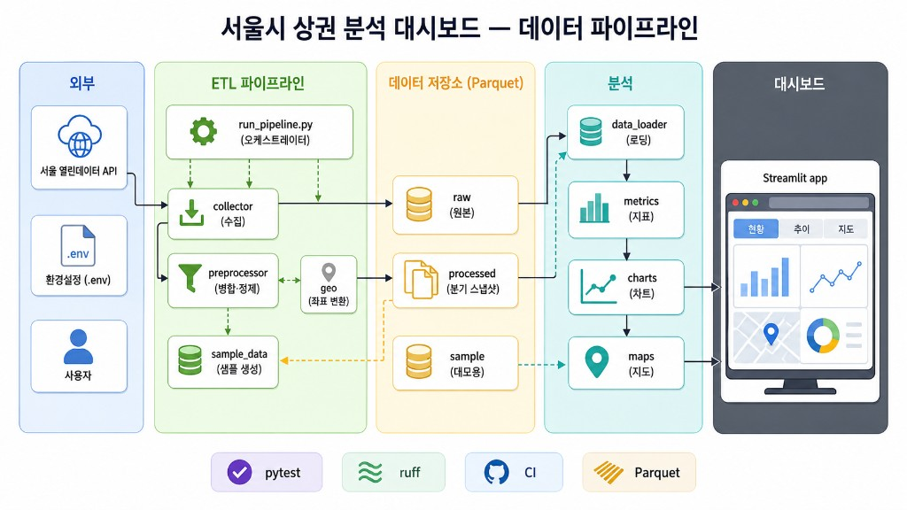
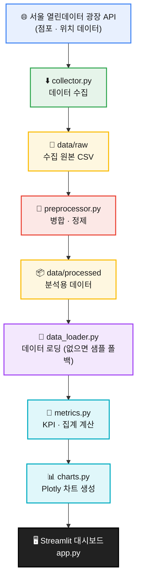

# 🛒 서울시 상권 데이터 분석 대시보드

[](https://github.com/JamesRhee1/seoul-local-market-remake/actions/workflows/ci.yml)


서울시 열린데이터 광장의 상권 데이터를 **수집 → 전처리 → 분석 → 시각화**하는 Streamlit 대시보드 프로젝트입니다.

---

## 프로젝트 개요

이 프로젝트는 [서울 열린데이터 광장](https://data.seoul.go.kr/)의 상권 데이터를 기반으로
서울시 상권 현황을 수집·전처리·분석하고, Streamlit 대시보드로 시각화합니다.

자치구·업종·분기 단위로 점포 수와 개업/폐업 흐름을 살펴볼 수 있으며,
데이터 수집부터 대시보드까지의 과정을 `src/` 패키지로 모듈화해
각 단계를 독립적으로 실행하고 테스트할 수 있도록 구성했습니다.

API 키나 대용량 데이터가 없어도, 저장소에 포함된 소형 샘플 데이터로 대시보드를 바로 실행할 수 있습니다.

---

## 주요 기능

- 서울시 상권(점포·위치) 데이터 수집 (서울 열린데이터 광장 API)
- `data/processed` 가공 데이터 우선 로딩
- 가공 데이터가 없으면 `data/sample` 샘플 데이터로 자동 폴백
- Streamlit 기반 인터랙티브 대시보드 제공
- 총 점포 수 / 개업 / 폐업 KPI 카드 표시
- 업종 및 자치구 기준 필터링
- 자치구별 개업 vs 폐업 Plotly 막대그래프 시각화
- **업종별 분기 추이** 라인 차트 (다분기 스냅샷 축적 시)
- **상권 단위 점포 밀도** pydeck 지도 (수집·전처리 데이터)
- 원본 데이터 테이블 조회
- KPI·집계 등 지표 계산 로직 모듈화 (순수 함수)
- `pytest` 기반 단위 테스트 지원

---

## 설치 및 실행 방법

### Linux / macOS

```bash
git clone https://github.com/JamesRhee1/seoul-local-market-remake.git
cd seoul-local-market-remake

python3 -m venv .venv
source .venv/bin/activate

pip install -r requirements.txt
streamlit run app.py
```

### Windows PowerShell

```powershell
git clone https://github.com/JamesRhee1/seoul-local-market-remake.git
cd seoul-local-market-remake

python -m venv .venv
.venv\Scripts\Activate.ps1

pip install -r requirements.txt
streamlit run app.py
```

가공 데이터가 없으면 대시보드는 자동으로 `data/sample/` 의 샘플 데이터로 실행됩니다.

### 데이터 파이프라인 한 번에 실행

수집 → 전처리 → README 인사이트 갱신을 한 번에 실행하려면:

```bash
python run_pipeline.py
```

- `SEOUL_API_KEY` 가 설정되어 있으면 수집부터, 없으면 수집을 건너뛰고 기존 데이터로 진행합니다.
- 각 단계는 `python -m src.collector`, `python -m src.preprocessor`, `python -m src.report` 로 개별 실행할 수도 있습니다.
- `TARGET_QUARTER` 를 바꿔가며 파이프라인을 반복 실행하면 `data/processed/seoul_market_*.parquet` 에 분기별 스냅샷이 축적되어 **분기 추이** 탭에서 비교할 수 있습니다.

---

## Streamlit Community Cloud 배포

이 저장소는 [Streamlit Community Cloud](https://streamlit.io/cloud) 배포를 전제로 구성되어 있습니다.
**대시보드 데모만** 올릴 경우 API 키 없이 `data/sample/` 폴백으로 동작합니다.

### 배포 절차

1. GitHub 저장소를 Streamlit Cloud 에 연결합니다.
2. **Main file path** 를 `app.py` 로 지정합니다.
3. **Python version** 을 `3.11` 이상으로 맞춥니다 (`requirements.txt` 기준).
4. (선택) 앱 **Settings → Secrets** 에 아래 형식으로 시크릿을 등록합니다.

### Secrets 예시 (`secrets.toml`)

Streamlit Cloud 콘솔의 Secrets 편집기에 TOML 형식으로 입력합니다.
**`.env` 파일은 Git에 올리지 마세요.** 로컬 개발용으로만 사용합니다.

```toml
# 서울 열린데이터 광장 인증키 (Cloud 에서 수집 파이프라인을 돌릴 때만 필요)
SEOUL_API_KEY = "your_key_here"

# (선택) 수집 상한
COLLECT_LIMIT = "20000"

# (선택) 특정 분기만 수집
TARGET_QUARTER = "20261"
```

| 항목 | 로컬 | Streamlit Cloud |
|---|---|---|
| API 키 | `.env` 의 `SEOUL_API_KEY` | Secrets 의 `SEOUL_API_KEY` |
| 데모 실행 | `data/sample/` 폴백 | 동일 (저장소에 포함) |
| 가공 데이터 | `data/processed/` (Git 제외) | Cloud 빌드에 없음 → 샘플 폴백 |
| 분기 추이·지도 | processed 재생성 후 사용 | 샘플만으로는 추이/지도 제한적 |

> **권장:** Community Cloud 앱은 **대시보드 전시용**으로 두고, 데이터 수집·전처리(`run_pipeline.py`)는 로컬 또는 CI/스케줄러에서 실행한 뒤 `data/processed` 를 별도 스토리지로 관리하는 방식이 안전합니다. processed 를 Cloud 에 포함시키려면 Git LFS·외부 스토리지 연동 등 추가 설계가 필요합니다.

### 배포 전 점검 체크리스트

- [ ] `requirements.txt` 에 `streamlit`, `pyarrow`, `pydeck`, `pyproj` 포함
- [ ] `app.py` 가 저장소 루트에 있음
- [ ] `.env` / 실제 API 키가 Git에 커밋되지 않음 (`.gitignore` 확인)
- [ ] `pytest` / `ruff check` 로컬 통과 (CI 워크플로 동일)

---

## 대시보드 활용 예시

대시보드를 통해 다음과 같은 질문을 탐색할 수 있습니다.

- 특정 자치구의 상권 규모(점포 수)는 어느 정도인가?
- 업종별 점포 수는 어떻게 다른가?
- 자치구별 개업/폐업 흐름은 어떻게 다른가?
- 특정 업종을 선택했을 때 자치구별 경쟁 강도는 어떻게 나타나는가?
- 샘플 데이터와 실제 가공 데이터를 바꿔가며 대시보드를 테스트할 수 있는가?

사이드바에서 업종과 자치구를 선택하면 KPI 카드와 자치구별 개업/폐업 차트가 함께 갱신됩니다.

---

## 데이터 기반 인사이트 (자동 생성)

`src/report.py` 가 가공 데이터에서 핵심 지표를 계산해 아래 구간을 자동으로 갱신합니다.
전처리(`python -m src.preprocessor`) 직후, 또는 `python -m src.report` 실행 시 최신 내용으로 바뀝니다.

<!-- AUTO-INSIGHTS:START -->

> 📂 아래 수치는 **실제 수집 데이터에서 자동 생성**되었습니다 — **최신 분기 `20261` 기준**, 점포 **75,972행** · 100개 업종 · 25개 자치구 · 1650개 상권. _(생성: 2026-06-11 13:47, `python -m src.report`)_

### 1. 성장하는 업종 vs 쇠퇴하는 업종 — "지금 뜨는 시장 / 지는 시장"

분기 내 **순증감(개업 − 폐업)** 으로 시장의 진입·철수 방향을 읽을 수 있습니다.

| 순증가 상위 (성장) | 개업 | 폐업 | 순증 | | 순감소 상위 (쇠퇴) | 개업 | 폐업 | 순증 |
|---|--:|--:|--:|---|---|--:|--:|--:|
| 피부관리실 | 429 | 237 | **+192** | | 일반의류 | 390 | 1,186 | **−796** |
| 슈퍼마켓 | 318 | 218 | **+100** | | 전자상거래업 | 6 | 681 | **−675** |
| DVD방 | 101 | 16 | **+85** | | 부동산중개업 | 18 | 519 | **−501** |

→ **인사이트:** 이번 분기 순증 1위는 **피부관리실**(+192), 순감소 1위는 **일반의류**(−796). 신규 창업·투자라면 순증 업종에, 리스크 관리라면 순감소 업종에 주목하게 됩니다.

### 2. 창업 리스크 — "여긴 들어가면 위험한 시장인가"

점포 수 대비 폐업 비중(**폐업률**)으로 업종의 생존 난이도를 가늠합니다. (점포 500개 이상 업종 대상)

| 업종 | 점포 수 | 폐업 | 폐업률 |
|---|--:|--:|--:|
| 치킨전문점 | 1,613 | 155 | **9.6%** |
| 편의점 | 1,735 | 151 | **8.7%** |
| 패스트푸드점 | 2,360 | 204 | **8.6%** |

→ **인사이트:** 진입장벽이 낮은 프랜차이즈형 업종일수록 회전율(폐업률)이 높음 → **과당경쟁·포화 신호**.

### 3. 입지/경쟁 강도 — "이 업종은 어느 자치구에 집중되나"

특정 업종을 선택하면 자치구별 점포 분포와 개·폐업이 한눈에 비교됩니다. 예: **커피-음료**

| 자치구 | 점포 수 | 개업 | 폐업 | 순증 |
|---|--:|--:|--:|--:|
| 강남구 | 1,709 | 61 | 78 | **−17** |
| 마포구 | 1,644 | 68 | 104 | **−36** |
| 종로구 | 1,277 | 52 | 46 | **+6** |

→ **인사이트:** **강남구**는 점포가 가장 많지만 폐업이 개업을 초과(포화·경쟁 심화) — "점포가 많다 = 좋은 입지"가 아니라 **밀집도와 순증감을 함께 봐야** 한다는 점을 보여줍니다.

<!-- AUTO-INSIGHTS:END -->

---

## 데이터 파이프라인 & 시스템 아키텍처

데이터는 **외부 API → ETL → CSV 저장소 → 분석 → Streamlit UI** 순으로 흐릅니다.
DB 없이 CSV 파일만 사용하며, `src/` 패키지로 각 단계가 분리되어 있습니다.

<p align="center">
  
</p>

다이어그램은 프로젝트 전체 구조를 5개 계층으로 정리한 것입니다.

| 계층 | 색상 | 구성 요소 | 역할 |
|---|---|---|---|
| **외부** | 파란색 | 사용자, 개발자, 서울 열린데이터 광장 API, `.env` | 브라우저·CLI 접점과 외부 데이터·인증 제공 |
| **ETL 파이프라인** | 초록색 | `collector.py`, `preprocessor.py`, `utils.py`, `config.py` | API 수집, Star Schema 병합(`TRDAR_CD`), 전처리 |
| **데이터 저장소** | 노란색 | `data/raw/`, `data/processed/`, `data/sample/` | CSV 기반 저장. processed 우선, 없으면 sample 폴백 |
| **분석** | 청록색 | `data_loader.py`, `metrics.py`, `charts.py`, `report.py` | 로딩, KPI·집계, Plotly 차트, README 인사이트 |
| **표현/UI** | 검정 | `app.py` (Streamlit) | 사이드바 필터, KPI 카드, 차트, 원본 데이터 테이블 |

- **실선 화살표**: API → 수집 → 전처리 → 분석 → 대시보드로 이어지는 주 데이터 흐름
- **점선 화살표**: `data/sample/` 폴백 경로, `report.py` 선택적 README 갱신

### 상세 흐름 (Mermaid)



- `collector.py` 가 API에서 점포(Fact)·위치(Dimension) 데이터를 수집해 `data/raw` 에 저장합니다.
- `preprocessor.py` 가 두 원천을 병합·정제해 `data/processed` 에 저장합니다.
- `data_loader.py` 가 가공 데이터(없으면 샘플)를 읽어 대시보드에 공급합니다.
- `metrics.py` 가 KPI와 집계 지표를 계산하고, `charts.py` 가 차트를 만들어 Streamlit 화면에 표시합니다.

---

## 프로젝트 구조

```text
seoul-local-market-remake/
├── app.py                  # Streamlit 대시보드 진입점 (UI 조립)
├── README.md
├── requirements.txt
├── .env.example            # API 키 템플릿
├── .gitignore
├── data/
│   ├── raw/                # 수집 원본 (Git 제외)
│   ├── processed/          # 전처리 결과 (Git 제외)
│   └── sample/             # 데모용 소형 샘플 (Git 포함)
├── src/
│   ├── config.py           # .env 로드 + 경로/서비스/컬럼 상수
│   ├── utils.py            # 로깅 + 재시도 HTTP + 페이지네이션
│   ├── collector.py        # API 수집 → data/raw
│   ├── preprocessor.py     # 병합/정제 (순수 함수) → data/processed
│   ├── data_loader.py      # 가공/샘플 데이터 로딩
│   ├── metrics.py          # KPI/집계 (순수 함수)
│   ├── charts.py           # Plotly 차트 생성
│   ├── maps.py             # pydeck 지도
│   ├── storage.py          # Parquet/CSV I/O
│   ├── geo.py              # TM→WGS84 좌표 변환
│   └── report.py           # 리포트/인사이트 생성
├── run_pipeline.py         # 수집→전처리→리포트 오케스트레이터
├── tests/
│   ├── test_metrics.py
│   ├── test_preprocessor.py
│   ├── test_charts.py
│   ├── test_data_loader.py
│   ├── test_storage.py
│   └── test_report.py
└── docs/
    ├── architecture.png      # 시스템 아키텍처 인포그래픽
    └── project_notes.md
```

---

## 환경변수 설정

`.env.example` 을 `.env` 로 복사한 뒤 필요한 값을 입력합니다.

### Linux / macOS

```bash
cp .env.example .env
```

### Windows PowerShell

```powershell
copy .env.example .env
```

`.env` 에서 설정할 수 있는 값은 다음과 같습니다.

| 변수 | 설명 |
|---|---|
| `SEOUL_API_KEY` | 서울 열린데이터 광장 인증키 (데이터 수집 시 필요) |
| `COLLECT_LIMIT` | 수집 기본 상한. `0` 또는 비우면 전체 수집 |
| `TARGET_QUARTER` | 기준 년분기 코드(예: `20261`). 비우면 전체 분기 수집 |

API 키 필요 여부는 다음과 같습니다.

- **샘플 데이터 기반 데모 실행**: API 키 없이 가능
- **서울시 API에서 신규 데이터 수집**: `SEOUL_API_KEY` 필요

---

## 데이터 관리 방식

`data/` 디렉토리는 용도에 따라 세 가지로 나뉩니다.

| 디렉토리 | 역할 | Git 추적 |
|---|---|---|
| `data/raw` | API에서 수집한 원본 데이터 | 제외 |
| `data/processed` | 병합·정제된 분석용 데이터 (Parquet, 분기 스냅샷) | 제외 |
| `data/sample` | GitHub에 포함되는 소형 데모 데이터 | 포함 |

- `data/sample` 은 누구나 클론 직후 대시보드를 체험할 수 있도록 포함된 소형 데이터입니다.
- `data/raw`, `data/processed` 는 대용량이거나 재생성 가능한 데이터이므로 Git 추적에서 제외하며, 로컬 또는 Nextcloud 등에서 관리합니다.
- 대시보드는 `data/processed` 데이터가 있으면 이를 우선 사용하고, 없으면 `data/sample` 데이터로 실행되도록 설계되어 있습니다.

---

## 주요 모듈 설명

| 파일 | 역할 |
|---|---|
| `app.py` | Streamlit 대시보드 진입점 (UI 조립) |
| `src/config.py` | 경로, 서비스명, 컬럼명, 환경변수 설정 |
| `src/utils.py` | 로깅 및 재시도/타임아웃 HTTP·페이지네이션 유틸 |
| `src/collector.py` | 서울시 API 데이터 수집 → `data/raw` |
| `src/preprocessor.py` | 원본 데이터 병합·정제 (순수 함수) → `data/processed` |
| `src/data_loader.py` | 가공/샘플 데이터 로딩 및 폴백 |
| `src/metrics.py` | KPI와 집계 지표 계산 (순수 함수) |
| `src/charts.py` | Plotly 차트 생성 |
| `src/maps.py` | pydeck 점포 밀도 지도 |
| `src/storage.py` | Parquet 저장·CSV 폴백 읽기 |
| `src/geo.py` | 상권 TM 좌표 → WGS84 변환 |
| `src/report.py` | 리포트/인사이트 생성 |
| `run_pipeline.py` | 수집→전처리→README 갱신 일괄 실행 |

데이터 스키마는 상권 코드(`TRDAR_CD`)를 조인 키로 하는 단순 Star Schema 구조입니다.

- **Fact**: `VwsmTrdarStorQq` (상권-점포: 점포 수, 개업/폐업 수)
- **Dimension**: `TbgisTrdarRelm` (상권 영역 → 자치구 `SIGNGU_CD_NM`)

---

## 테스트 실행

테스트·린트 도구는 개발용 의존성으로 분리되어 있습니다.

```bash
pip install -r requirements-dev.txt
```

### Linux / macOS

```bash
ruff check .
pytest
```

### Windows PowerShell

```powershell
ruff check .
pytest
```

GitHub Actions(`.github/workflows/ci.yml`)에서 push/PR 마다 Python 3.11/3.12 로 동일한 검사를 수행합니다.

---

## 리메이크 방향

이 프로젝트는 기존 서울시 상권 분석 프로젝트를 기반으로, 데이터 수집·전처리·분석·시각화 로직을 모듈화한 리메이크 버전입니다.

기존 프로젝트의 핵심 아이디어는 유지하되, 다음 부분을 개선했습니다.

- `app.py` 중심 구조를 `src/` 기반 모듈 구조로 분리
- `.env` 기반 API 키 관리
- 샘플 데이터 기반 데모 실행 지원
- 테스트 가능한 지표 계산 함수 분리
- Streamlit 대시보드 구조 개선

자세한 비교 분석과 리메이크 과정은 별도 보고서(`docs/`)에서 다룹니다.

---

## 향후 개선 과제

- 대시보드 UI 스크린샷 추가 (시스템 아키텍처 다이어그램은 `docs/architecture.png` 참고)
- Cloud 배포 시 processed 데이터 외부 스토리지 연동
- 데이터 수집 스케줄링 (분기별 자동 스냅샷)
- 자치구 단위 choropleth 지도 (GeoJSON 경계 데이터 연동)
