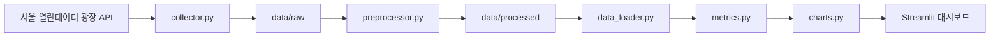

# 🛒 서울시 상권 데이터 분석 대시보드


서울시 열린데이터 광장의 상권 데이터를 **수집 → 전처리 → 분석 → 시각화**하는 Streamlit 대시보드 프로젝트입니다.

---

## 프로젝트 개요

이 프로젝트는 [서울 열린데이터 광장](https://data.seoul.go.kr/)의 상권 데이터를 기반으로
서울시 상권 현황을 수집·전처리·분석하고, Streamlit 대시보드로 시각화합니다.

자치구·업종·분기 단위로 점포 수와 개업/폐업 흐름을 살펴볼 수 있으며,
데이터 수집부터 대시보드까지의 과정을 `src/` 패키지로 모듈화해
각 단계를 독립적으로 실행하고 테스트할 수 있도록 구성했습니다.

API 키나 대용량 데이터가 없어도, 저장소에 포함된 소형 샘플 데이터로 대시보드를 바로 실행할 수 있습니다.

---

## 주요 기능

- 서울시 상권(점포·위치) 데이터 수집 (서울 열린데이터 광장 API)
- `data/processed` 가공 데이터 우선 로딩
- 가공 데이터가 없으면 `data/sample` 샘플 데이터로 자동 폴백
- Streamlit 기반 인터랙티브 대시보드 제공
- 총 점포 수 / 개업 / 폐업 KPI 카드 표시
- 업종 및 자치구 기준 필터링
- 자치구별 개업 vs 폐업 Plotly 막대그래프 시각화
- 원본 데이터 테이블 조회
- KPI·집계 등 지표 계산 로직 모듈화 (순수 함수)
- `pytest` 기반 단위 테스트 지원

---

## 데이터 파이프라인

데이터는 다음 흐름으로 수집·가공되어 대시보드까지 연결됩니다.



- `collector.py` 가 API에서 점포(Fact)·위치(Dimension) 데이터를 수집해 `data/raw` 에 저장합니다.
- `preprocessor.py` 가 두 원천을 병합·정제해 `data/processed` 에 저장합니다.
- `data_loader.py` 가 가공 데이터(없으면 샘플)를 읽어 대시보드에 공급합니다.
- `metrics.py` 가 KPI와 집계 지표를 계산하고, `charts.py` 가 차트를 만들어 Streamlit 화면에 표시합니다.

---

## 프로젝트 구조

```text
seoul-local-market-remake/
├── app.py                  # Streamlit 대시보드 진입점 (UI 조립)
├── README.md
├── requirements.txt
├── .env.example            # API 키 템플릿
├── .gitignore
├── data/
│   ├── raw/                # 수집 원본 (Git 제외)
│   ├── processed/          # 전처리 결과 (Git 제외)
│   └── sample/             # 데모용 소형 샘플 (Git 포함)
├── src/
│   ├── config.py           # .env 로드 + 경로/서비스/컬럼 상수
│   ├── utils.py            # 로깅 + 재시도 HTTP + 페이지네이션
│   ├── collector.py        # API 수집 → data/raw
│   ├── preprocessor.py     # 병합/정제 (순수 함수) → data/processed
│   ├── data_loader.py      # 가공/샘플 데이터 로딩
│   ├── metrics.py          # KPI/집계 (순수 함수)
│   ├── charts.py           # Plotly 차트 생성
│   └── report.py           # 리포트/인사이트 생성
├── tests/
│   ├── test_metrics.py
│   ├── test_preprocessor.py
│   └── test_report.py
└── docs/
    └── project_notes.md
```

---

## 설치 및 실행 방법

### Linux / macOS

```bash
git clone https://github.com/JamesRhee1/seoul-local-market-remake.git
cd seoul-local-market-remake

python3 -m venv .venv
source .venv/bin/activate

pip install -r requirements.txt
streamlit run app.py
```

### Windows PowerShell

```powershell
git clone https://github.com/JamesRhee1/seoul-local-market-remake.git
cd seoul-local-market-remake

python -m venv .venv
.venv\Scripts\Activate.ps1

pip install -r requirements.txt
streamlit run app.py
```

가공 데이터가 없으면 대시보드는 자동으로 `data/sample/` 의 샘플 데이터로 실행됩니다.

---

## 환경변수 설정

`.env.example` 을 `.env` 로 복사한 뒤 필요한 값을 입력합니다.

### Linux / macOS

```bash
cp .env.example .env
```

### Windows PowerShell

```powershell
copy .env.example .env
```

`.env` 에서 설정할 수 있는 값은 다음과 같습니다.

| 변수 | 설명 |
|---|---|
| `SEOUL_API_KEY` | 서울 열린데이터 광장 인증키 (데이터 수집 시 필요) |
| `COLLECT_LIMIT` | 수집 기본 상한. `0` 또는 비우면 전체 수집 |
| `TARGET_QUARTER` | 기준 년분기 코드(예: `20261`). 비우면 전체 분기 수집 |

API 키 필요 여부는 다음과 같습니다.

- **샘플 데이터 기반 데모 실행**: API 키 없이 가능
- **서울시 API에서 신규 데이터 수집**: `SEOUL_API_KEY` 필요

---

## 데이터 관리 방식

`data/` 디렉토리는 용도에 따라 세 가지로 나뉩니다.

| 디렉토리 | 역할 | Git 추적 |
|---|---|---|
| `data/raw` | API에서 수집한 원본 데이터 | 제외 |
| `data/processed` | 병합·정제된 분석용 데이터 | 제외 |
| `data/sample` | GitHub에 포함되는 소형 데모 데이터 | 포함 |

- `data/sample` 은 누구나 클론 직후 대시보드를 체험할 수 있도록 포함된 소형 데이터입니다.
- `data/raw`, `data/processed` 는 대용량이거나 재생성 가능한 데이터이므로 Git 추적에서 제외하며, 로컬 또는 Nextcloud 등에서 관리합니다.
- 대시보드는 `data/processed` 데이터가 있으면 이를 우선 사용하고, 없으면 `data/sample` 데이터로 실행되도록 설계되어 있습니다.

---

## 주요 모듈 설명

| 파일 | 역할 |
|---|---|
| `app.py` | Streamlit 대시보드 진입점 (UI 조립) |
| `src/config.py` | 경로, 서비스명, 컬럼명, 환경변수 설정 |
| `src/utils.py` | 로깅 및 재시도/타임아웃 HTTP·페이지네이션 유틸 |
| `src/collector.py` | 서울시 API 데이터 수집 → `data/raw` |
| `src/preprocessor.py` | 원본 데이터 병합·정제 (순수 함수) → `data/processed` |
| `src/data_loader.py` | 가공/샘플 데이터 로딩 및 폴백 |
| `src/metrics.py` | KPI와 집계 지표 계산 (순수 함수) |
| `src/charts.py` | Plotly 차트 생성 |
| `src/report.py` | 리포트/인사이트 생성 |

데이터 스키마는 상권 코드(`TRDAR_CD`)를 조인 키로 하는 단순 Star Schema 구조입니다.

- **Fact**: `VwsmTrdarStorQq` (상권-점포: 점포 수, 개업/폐업 수)
- **Dimension**: `TbgisTrdarRelm` (상권 영역 → 자치구 `SIGNGU_CD_NM`)

---

## 대시보드 활용 예시

대시보드를 통해 다음과 같은 질문을 탐색할 수 있습니다.

- 특정 자치구의 상권 규모(점포 수)는 어느 정도인가?
- 업종별 점포 수는 어떻게 다른가?
- 자치구별 개업/폐업 흐름은 어떻게 다른가?
- 특정 업종을 선택했을 때 자치구별 경쟁 강도는 어떻게 나타나는가?
- 샘플 데이터와 실제 가공 데이터를 바꿔가며 대시보드를 테스트할 수 있는가?

사이드바에서 업종과 자치구를 선택하면 KPI 카드와 자치구별 개업/폐업 차트가 함께 갱신됩니다.

---

## 테스트 실행

### Linux / macOS

```bash
python3 -m py_compile app.py src/*.py
pytest
```

### Windows PowerShell

```powershell
python -m py_compile app.py src\*.py
pytest
```

---

## 리메이크 방향

이 프로젝트는 기존 서울시 상권 분석 프로젝트를 기반으로, 데이터 수집·전처리·분석·시각화 로직을 모듈화한 리메이크 버전입니다.

기존 프로젝트의 핵심 아이디어는 유지하되, 다음 부분을 개선했습니다.

- `app.py` 중심 구조를 `src/` 기반 모듈 구조로 분리
- `.env` 기반 API 키 관리
- 샘플 데이터 기반 데모 실행 지원
- 테스트 가능한 지표 계산 함수 분리
- Streamlit 대시보드 구조 개선

자세한 비교 분석과 리메이크 과정은 별도 보고서(`docs/`)에서 다룹니다.

---

## 향후 개선 과제

- 대시보드 스크린샷 추가
- GitHub Actions 기반 테스트 자동화
- 실제 데이터 기반 분석 리포트 추가
- 지도 시각화 추가
- 배포 환경 구성
- 데이터 수집 스케줄링
