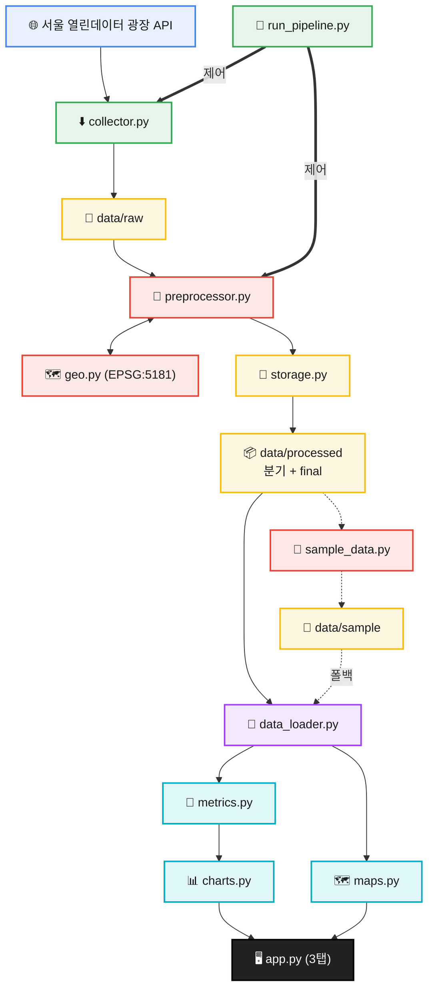

# 서울시 상권 데이터 분석 프로젝트 리메이크 보고서

> [!NOTE]
> **한 줄 요약** — 동작 위주의 단일 스크립트형 상권 분석 프로젝트를, 수집·전처리·로딩·지표·시각화를 분리한 모듈형 구조로 다시 설계하고, `.env` 기반 보안·샘플 데이터 기반 데모 실행·`pytest` 테스트까지 갖춘 리메이크 버전으로 정리한 기록.

## 목차

1. [문서 목적](#1-문서-목적)
2. [프로젝트 개요](#2-프로젝트-개요)
3. [리메이크 배경](#3-리메이크-배경)
4. [기존 프로젝트의 한계](#4-기존-프로젝트의-한계)
5. [리메이크 목표](#5-리메이크-목표)
6. [기존 버전 vs 리메이크 버전 비교](#6-기존-버전-vs-리메이크-버전-비교)
7. [리메이크 버전의 전체 구조](#7-리메이크-버전의-전체-구조)
8. [데이터 파이프라인 비교](#8-데이터-파이프라인-비교)
9. [데이터 전처리 개선점](#9-데이터-전처리-개선점)
10. [시각화 및 대시보드 개선점](#10-시각화-및-대시보드-개선점)
11. [실행 방식과 재현성 개선](#11-실행-방식과-재현성-개선)
12. [테스트 및 검증](#12-테스트-및-검증)
13. [포트폴리오 관점에서의 의미](#13-포트폴리오-관점에서의-의미)
14. [남은 개선 과제](#14-남은-개선-과제)
15. [개인 회고](#15-개인-회고)
16. [다음 액션](#16-다음-액션)

---

## 1. 문서 목적

이 문서는 사용 설명서(README)가 아니라, **리메이크 과정과 개선점을 정리하는 분석 보고서**다. 저장소의 `README.md`가 "어떻게 설치하고 실행하는가"에 집중한다면, 이 문서는 "왜 다시 만들었고, 무엇이 어떻게 좋아졌는가"에 집중한다.

| 문서 | 역할 | 독자 |
|---|---|---|
| `README.md` | 프로젝트 사용법·실행 방법 중심 | 저장소 방문자, 실행하려는 사람 |
| `docs/project_notes.md` (이 문서) | 리메이크 배경·비교 분석·구조 개선·회고 중심 | 작성자 본인, 포트폴리오 검토자 |

이 문서는 GitHub 저장소에서 관리하는 보고서 버전이다. 별도로 Obsidian Vault용 버전을 함께 관리한다.

---

## 2. 프로젝트 개요

- **무엇**: 서울시 상권(점포·위치) 데이터를 수집·전처리·분석하고 Streamlit 대시보드로 시각화하는 데이터 프로젝트.
- **데이터 출처**: [서울 열린데이터 광장](https://data.seoul.go.kr/) 상권 API (점포 `VwsmTrdarStorQq`, 상권 영역 `TbgisTrdarRelm`).
- **기술 스택**: Python, pandas, Streamlit, Plotly, pydeck, pyarrow, pyproj, requests, python-dotenv, pytest, ruff.
- **분석 기준 분기**: 2025년 1~4분기 (`20251`~`20254`, UI 표기 `2025-4분기`).
- **실행 특성**:
  - 서울시 열린데이터 광장 API로 신규 데이터를 수집할 수 있다(키 필요).
  - 키나 대용량 데이터가 없어도 저장소에 포함된 **샘플 데이터로 데모 실행**이 가능하다.
- **구조 특성**: 데이터 수집·전처리·로딩·지표 계산·차트 생성을 `src/` 패키지로 분리한 모듈 구조.

분석 단위는 자치구(`SIGNGU_CD_NM`), 업종(`SVC_INDUTY_CD_NM`), 점포 수(`STOR_CO`)와 개업/폐업 수(`OPBIZ_STOR_CO` / `CLSBIZ_STOR_CO`)이며, 상권 코드(`TRDAR_CD`)를 조인 키로 하는 단순 Star Schema 구조를 따른다.

---

## 3. 리메이크 배경

이 작업의 핵심 동기는 **"동작하는 프로젝트"를 "유지보수·설명 가능한 프로젝트"로 바꾸는 것**이었다.

- 단순히 결과가 나오는 코드에서, 구조를 설명할 수 있는 코드로 전환한다.
- 개인 포트폴리오로 제시했을 때, 설계 의도를 말로 설명할 수 있는 구조를 만든다.
- 데이터 수집·전처리·분석·시각화의 책임을 분리해 변경 영향 범위를 좁힌다.
- 외부 데이터·API 키가 없는 상태에서도 실행 가능한 데모 경로를 확보한다.
- 핵심 로직을 함수 단위로 테스트할 수 있는 구조를 확보한다.

---

## 4. 기존 프로젝트의 한계

아래 항목은 기존 `seoul-local-market-analysis` 구조에 대한 작성자 기록과, 리메이크 과정에서 개선 대상으로 삼은 내용을 정리한 것이다. 기존 저장소를 직접 재실행해 확인한 것이 아닌 항목은 단정하지 않고 "개선 여지가 있었다"로 표현한다.

| 한계 | 설명 |
|---|---|
| 로직 집중 | 데이터 로딩·필터·집계·시각화가 `app.py` 중심에 절차적으로 모여 있어 변경/테스트가 어려운 구조였던 것으로 파악된다. |
| 데이터와 UI 결합 | 데이터 처리 로직과 화면 표시 로직이 섞여, 한쪽 변경이 다른 쪽에 영향을 주기 쉬웠다. |
| API 키 관리 | 키를 실행 가능한 설정 파일에 두는 방식이라, 표준 환경변수(`.env`) 방식으로 개선할 여지가 있었다. |
| 데이터 파일 정책 | 대용량 CSV의 Git 추적 여부 등 데이터 관리 정책이 명확하지 않아 정리할 필요가 있었다. |
| 테스트 부재 | 회귀를 잡아줄 자동화된 테스트 구조가 부족했다. |
| 재현성 | 의존성·실행 명령·샘플 데이터가 정리되어 있지 않으면 다른 환경에서 재현이 어렵다. |
| 문서화 | 사용법과 분석/회고가 한 문서에 섞이면 전달력이 떨어질 수 있어, 역할을 분리할 필요가 있었다. |

---

## 5. 리메이크 목표

| 목표 | 설명 |
|---|---|
| 모듈화 | 데이터 수집·전처리·로딩·지표 계산·차트 생성을 `src/` 하위 모듈로 분리 |
| 재현성 | `requirements.txt`(버전 고정), 샘플 데이터, 실행 명령어 정리 |
| 보안성 | `.env` 기반 API 키 관리 및 로그 내 키 마스킹 |
| 테스트 가능성 | KPI·전처리 로직을 순수 함수로 분리해 `pytest`로 검증 |
| 실행 안정성 | HTTP 타임아웃·재시도, 결측/형변환 방어 처리 |
| 문서화 | README(사용법)와 보고서(분석/회고) 역할 분리 |

---

## 6. 기존 버전 vs 리메이크 버전 비교

이 보고서에서 가장 중요한 섹션이다. 리메이크 버전은 현재 저장소 코드 기준으로 검증된 내용이며, 기존 버전 칸은 위 [4. 기존 프로젝트의 한계](#4-기존-프로젝트의-한계)와 같은 전제하에 작성한다.

| 항목 | 기존 버전 | 리메이크 버전 | 개선 효과 |
|---|---|---|---|
| 프로젝트 구조 | 단일 앱(`app.py`) 중심 | `src/` 모듈 구조(15개+ 모듈) + `run_pipeline.py` | 유지보수성·가독성 향상 |
| 데이터 로딩 | 특정 가공 파일에 의존 | processed 우선, 없으면 sample fallback (`data_loader.resolve_data_path`) | 실행 안정성 향상 |
| API 키 관리 | 설정 파일 중심 | `.env` 기반(`config.py` + python-dotenv), 로그 키 마스킹 | 민감정보 관리 개선 |
| 수집 안정성 | 타임아웃·재시도 개선 여지 | `utils.fetch_json` 타임아웃·재시도·지수 백오프 | 일시적 오류에 견고 |
| 전처리 | 스크립트/함수 결합 | 순수 함수(`clean_numeric`/`build_dimension`/`merge_market_data`)와 I/O(`run`) 분리 | 재사용성·테스트 용이성 |
| 시각화 | 앱 내부 로직 중심 | `charts`/`maps` 분리, 3탭(현황·추이·지도) | UI와 시각화 로직 분리 |
| 지표 계산 | 앱 내부 집계 | `metrics` 순수 함수(KPI/집계/옵션) | 단위 테스트 가능 |
| 테스트 | 부족하거나 없음 | `pytest` 52개 + GitHub Actions CI (ruff, 3.11/3.12) | 회귀 검증 자동화 |
| 저장 포맷 | CSV 중심 | Parquet 저장 + CSV 폴백(`storage.py`) | I/O 효율·호환 |
| 데이터 거버넌스 | 대용량 CSV 추적 가능성 | raw/processed Git 제외, sample Parquet(4분기) 포함 | 저장소 경량화 |
| 문서화 | 기능 설명 중심 | README(사용법) + 보고서(분석) 분리 | 전달력 향상 |

---

## 7. 리메이크 버전의 전체 구조

현재 저장소 구조는 다음과 같다.

```text
seoul-local-market-remake/
├── app.py                  # Streamlit 진입점 (3탭 UI)
├── run_pipeline.py         # 수집→전처리→README 갱신 오케스트레이터
├── README.md
├── requirements.txt
├── requirements-dev.txt    # pytest, ruff
├── .env.example
├── data/
│   ├── raw/                # 수집 원본 Parquet (Git 제외)
│   ├── processed/          # 분기 스냅샷 Parquet (Git 제외)
│   └── sample/             # 2025 1~4분기 데모 Parquet (Git 포함)
├── src/
│   ├── config.py           # .env/Secrets + DEMO_QUARTERS
│   ├── collector.py        # API 수집
│   ├── preprocessor.py     # 병합·좌표·분기 스냅샷
│   ├── data_loader.py      # processed/sample 폴백·분기 추이 로딩
│   ├── storage.py          # Parquet/CSV I/O
│   ├── geo.py              # TM→WGS84
│   ├── metrics.py          # KPI·집계·format_quarter_label
│   ├── charts.py           # Plotly (막대·2단 추이)
│   ├── maps.py             # pydeck 밀도 지도
│   ├── sample_data.py      # processed→sample 생성
│   └── report.py           # README AUTO-INSIGHTS
├── tests/                  # 52개
└── docs/
    ├── architecture.png
    └── project_notes.md
```

폴더별 역할:

| 경로 | 역할 |
|---|---|
| `app.py` | 사이드바 필터·KPI·차트 위젯을 배치하는 얇은 UI 계층. 도메인 로직은 `src`에 위임 |
| `src/` | 수집·전처리·로딩·지표·차트·리포트 도메인 로직 패키지 |
| `data/raw`, `data/processed` | 수집 원본·가공 결과(대용량, Git 제외) |
| `data/sample` | 2025년 1~4분기(`20251`~`20254`) 소형 데모 Parquet 스냅샷(Git 포함) |
| `tests/` | 순수 함수 단위 테스트 |
| `docs/` | 분석 보고서 등 문서 |

---

## 8. 데이터 파이프라인 비교

기존 버전은 (확인된 범위에서) 데이터 적재와 화면 표시가 사실상 한 흐름에 묶여 있었던 반면, 리메이크 버전은 단계마다 입력과 출력이 명확한 파이프라인으로 분리되어 있다.

리메이크 버전의 데이터 흐름:



단계별 설명:

1. **API 수집**: `collector`가 `TARGET_QUARTER`(예: `20254`)별로 점포·위치 데이터를 페이지네이션 수집한다.
2. **raw 저장**: `storage.write_table`로 `data/raw/*.parquet`에 저장한다.
3. **processed 생성**: `preprocessor.run`이 병합·좌표(`geo.py`)·분기 스냅샷(`seoul_market_{분기}.parquet`)을 생성하고 합본 `seoul_market_final.parquet`를 만든다.
4. **sample 생성**: `python -m src.sample_data`로 processed에서 2025 4분기 소형 샘플을 `data/sample/`에 복제한다.
5. **sample fallback**: processed가 없으면 `data/sample` 분기 스냅샷으로 분기 추이·지도까지 데모 가능.
6. **대시보드**: `app.py` 3탭 — 현황(KPI·막대), 분기 추이(2단 패널), 점포 밀도 지도(색상 그라데이션).

> [!NOTE]
> **오케스트레이션** — `run_pipeline.py`가 수집→전처리→`report.update_readme` 순으로 실행한다. `preprocessor`는 report에 의존하지 않는다.

---

## 9. 데이터 전처리 개선점

전처리는 `src/preprocessor.py`에 집중되어 있으며, 변환 로직을 입출력이 명확한 순수 함수로 분리한 것이 핵심이다.

| 함수 | 성격 | 역할 |
|---|---|---|
| `clean_numeric` | 순수 함수 | 수치형 컬럼을 `to_numeric(errors="coerce")`로 강제 변환 후 결측 0으로 채움 |
| `normalize_key` | 순수 함수 | 상권코드를 `Int64`→문자열로 정규화해 `.0` 혼선·조인 깨짐 방지 |
| `build_dimension` | 순수 함수 | 상권코드→자치구·TM좌표 차원(`TRDAR_CD_NM` 제외 — Fact 보유), `geo.py`로 `lon`/`lat` 변환 |
| `merge_market_data` | 순수 함수 | 점포(Fact)에 위치 차원 Left Join, `Unknown` 처리 |
| `split_by_quarter` | 순수 함수 | 분기별 스냅샷 분할 (`20251`~`20254` 축적) |
| `normalize_processed_dtypes` | 순수 함수 | Parquet 병합 시 dtype 통일 |
| `run` | I/O | raw 읽기 → 병합/정제 → 분기 스냅샷·합본 Parquet 저장 |

개선 관점:

- **원본/가공 분리**: 수집 원본(`data/raw`)과 가공 결과(`data/processed`)를 물리적으로 분리해 재처리 추적이 쉬워졌다.
- **숫자형 정제**: 문자열/결측이 섞인 컬럼을 강제 형변환해 집계가 깨지지 않는다(테스트로 검증됨).
- **조인 안정성**: 키 정규화와 차원 중복 제거로 병합 시 행 증식을 방어한다.
- **필터링 기반 마련**: 자치구·업종·분기 컬럼이 정제되어, 대시보드에서 자치구/업종 기준 필터링이 가능하다.
- **역할 분리**: sample 데이터는 데모용, processed 데이터는 실제 분석용으로 명확히 구분된다.

---

## 10. 시각화 및 대시보드 개선점

대시보드는 `app.py`가 UI 조립만 담당하고, 계산·시각화는 `metrics`/`charts`/`maps`로 위임하는 구조다.

| 탭 | 내용 |
|---|---|
| 현황 분석 | 최신 분기(`2025-4분기` 라벨) KPI, 자치구별 개업/폐업 막대 차트 |
| 업종별 분기 추이 | 2단 패널(총 점포 / 개업·폐업), 2025년 4분기 라인 차트 |
| 점포 밀도 지도 | pydeck Scatterplot, 크기·색상(파랑→노랑→빨강) ∝ 점포 수 |

- **KPI/UI 분리**: `metrics.compute_kpi`, `filter_latest_quarter`, `aggregate_industry_by_quarter`, `aggregate_for_map`
- **분기 라벨**: `metrics.format_quarter_label` — `20254` → `2025-4분기`
- **샘플 데모**: `data/sample/` 4분기 Parquet로 API 키 없이 3탭 모두 동작

---

## 11. 실행 방식과 재현성 개선

실행/검증에 사용하는 명령어는 다음과 같다.

```bash
pip install -r requirements.txt -r requirements-dev.txt
ruff check .
pytest
python run_pipeline.py          # API 키 있을 때
python -m src.sample_data       # processed → sample
streamlit run app.py
```

검증 상태 (2026-06-11 기준):

| 명령 | 상태 |
|---|---|
| `pytest` | **52개** 전체 통과 |
| `ruff check .` | 통과 |
| GitHub Actions | push/PR 시 Python 3.11/3.12 matrix |
| `streamlit run app.py` | sample 4분기 Parquet로 3탭 데모 가능 |

재현성을 높인 요소:

- `requirements.txt`: streamlit, pandas, plotly, pyarrow, pydeck, pyproj, requests, python-dotenv
- `requirements-dev.txt`: pytest, ruff, requests-mock
- `config.DEMO_QUARTERS`: 2025년 1~4분기 고정
- `python -m src.sample_data`로 데모 데이터 재생성 가능

---

## 12. 테스트 및 검증

- `tests/` 디렉터리에 `pytest` 기반 테스트가 존재한다.
- 순수 함수 중심으로 작성되어 외부 I/O 없이 빠르게 검증된다.

| 테스트 파일 | 검증 대상 |
|---|---|
| `test_metrics.py` | KPI, 분기 필터/집계, `format_quarter_label`, 지도 집계 |
| `test_preprocessor.py` | 수치 정제, 차원·좌표, `split_by_quarter`, 스키마 검증 |
| `test_charts.py` | 막대·2단 추이 차트 골격 |
| `test_maps.py` | 밀도 색상, pydeck 레이어 |
| `test_data_loader.py` | processed/sample 폴백, 분기 스냅샷 로딩 |
| `test_storage.py` | Parquet/CSV 폴백, 5자리 분기 코드만 스냅샷 인정 |
| `test_pipeline_integration.py` | `preprocessor.run()` 2회 연속 멱등성 |
| `test_utils.py` | API 오류 처리, 페이지네이션 |
| `test_report.py` | 인사이트 생성, 최신 분기만 사용 |
| `test_sample_data.py` | sample 분기 스냅샷 생성 |
| `test_geo.py` | TM→WGS84 변환 (EPSG:5181, 강남역 ±0.001°) |

---

## 13. 포트폴리오 관점에서의 의미

| 역량 | 프로젝트에서 드러나는 부분 |
|---|---|
| 데이터 파이프라인 설계 | 수집 → raw → 전처리 → processed → 로딩 → 지표 → 차트 흐름 구성 |
| Python 모듈화 | `src/` 기반 역할 분리(8개 모듈), 순수 함수와 I/O 분리 |
| 대시보드 구현 | Streamlit + Plotly 기반 인터랙티브 UI |
| 재현성 관리 | 버전 고정 `requirements.txt`, 샘플 데이터, 실행 명령 정리 |
| 보안 의식 | `.env` 기반 키 관리, 로그 키 마스킹, `.gitignore` 정책 |
| 테스트 습관 | `pytest` 52개 + CI로 핵심 로직·멱등성 회귀 검증 |
| 문서화 | README(사용법)와 분석 보고서(이 문서) 역할 분리 |

핵심 메시지는 "데이터 분석 프로젝트도 소프트웨어 엔지니어링 관점에서 구조화·테스트·문서화될 수 있다"는 점을 보여주는 것이다.

---

## 14. 남은 개선 과제

- [ ] 대시보드 3탭 스크린샷 추가
- [x] GitHub Actions CI (ruff + pytest, 3.11/3.12)
- [x] 2025년 1~4분기 분기 추이 시각화 (2단 패널)
- [x] pydeck 점포 밀도 지도 (색상·크기 그라데이션)
- [x] Parquet 저장 + CSV 폴백
- [x] Streamlit Cloud 배포 가이드 (README)
- [x] 분기별 sample Parquet (`src/sample_data.py`)
- [ ] `docs/architecture.png` 갱신 (Parquet·3탭·지도 반영)
- [ ] 데이터 수집 스케줄링 (2026년 이후 분기 자동 스냅샷)
- [ ] 자치구 choropleth 지도 (GeoJSON)
- [ ] Cloud 배포 시 processed 외부 스토리지 연동

---

## 15. 개인 회고

- 기존 코드를 부분적으로 고치는 것보다, **구조를 다시 설계**하는 편이 장기적으로 설명·유지보수가 쉽다는 것을 체감했다. 특히 책임을 모듈로 나누니 "어디를 고쳐야 하는가"가 분명해졌다.
- 데이터 분석 프로젝트라도 **소프트웨어 구조화**(순수 함수 분리, 테스트, 의존성 고정)가 결과 품질만큼 중요하다는 점을 다시 확인했다. 순수 함수로 분리하니 테스트 작성이 자연스러웠다.
- **README와 보고서의 역할을 분리**하는 결정이 문서 가독성을 크게 높였다. 사용법과 회고가 한 문서에 섞이면 둘 다 흐려진다.
- **샘플 데이터 기반 실행 가능성**은 포트폴리오 품질에 직접적인 영향을 준다. 클론 직후 키 없이 동작하는 데모는 검토자의 진입장벽을 낮춘다.
- 반복적인 리팩토링·문서화 작업에서 **Cursor Agent를 활용**해 구조 정리와 문서 작성 속도를 높일 수 있었다. 다만 생성된 내용이 실제 코드와 일치하는지 검증하는 책임은 여전히 사람에게 있다는 점을 유지했다.

---

## 16. 다음 액션

1. 대시보드 3탭 스크린샷 촬영·README 삽입
2. `docs/architecture.png` 인포그래픽 갱신
3. 2026년 분기 데이터 수집 시 `TARGET_QUARTER` 스케줄링 검토
4. Obsidian Vault와 이 보고서 동기화

---

> 관련 문서: 저장소 사용 설명서 `README.md` · 본 보고서 `docs/project_notes.md` (별도 Obsidian Vault 버전 병행 관리)
